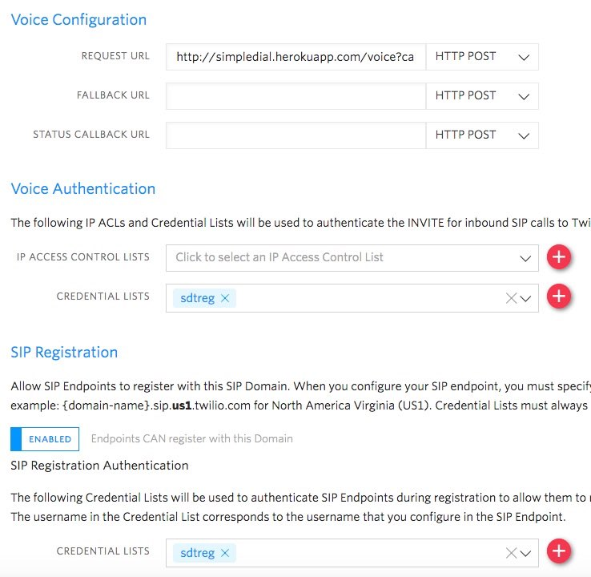
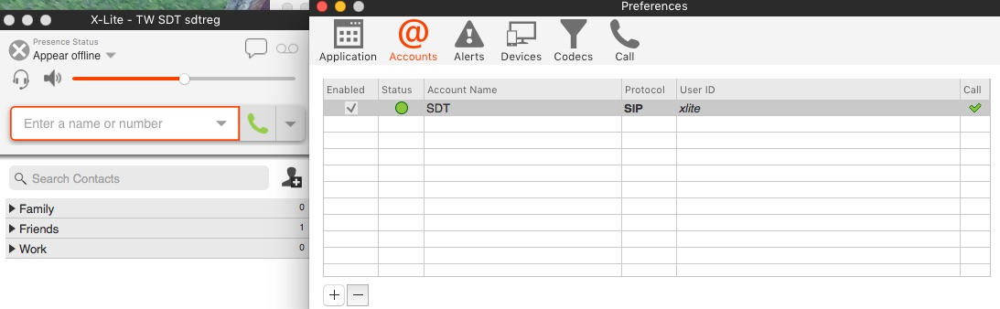
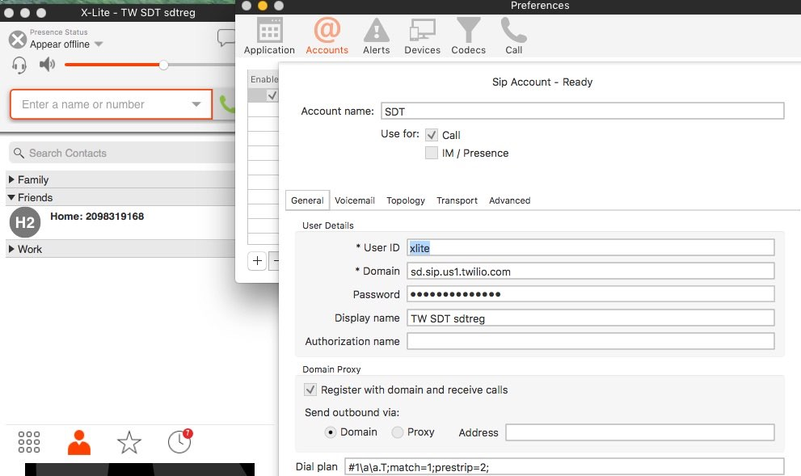
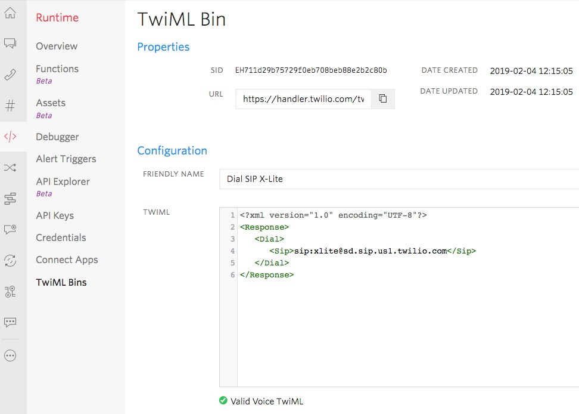
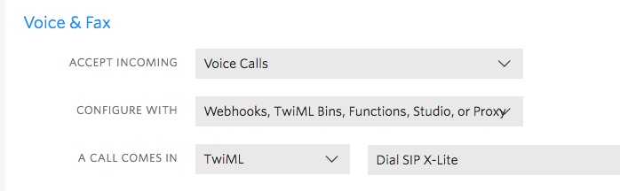

# Setting up a SIP Phone

Following, are the steps I used to implement and test PKCV.

(Note, work in progress)

Links:
+ [Blog post](https://www.twilio.com/blog/registering-sip-phone-twilio-inbound-outbound)
with general information regarding the set up steps:

For simplicity, I suggest you use our SIP Domain product where 
we manage the PBX functions which you configure using your browser.

Sample SIP phone, [Grandstream](https://www.amazon.com/Grandstream-Business-Single-account-GXP1610/dp/B01318HLCC)

[Article](https://www.twilio.com/blog/2017/08/making-phone-calls-using-twilio-sip.html)
which covers configuring a Twilio SIP Domain for making and receiving calls

--------------------------------------------------------------------------------
### Sample SIP Software Configuration

Following is a sample configuration using X-Lite 
which is a SIP software program for making and receiving SIP voice calls. 
I included the X-Lite configuration as a sample for you to use.

There are 2 major parts to the setup: the SIP phone software/hardware configuration itself, 
and the Twilio Console configurations. As well, the instructions are separated into outgoing and incoming phone calls.

##### Twilio Console configurations

Log into the [Twilio Console](https://www.twilio.com/console).

List your [Twilio SIP Domains](https://www.twilio.com/console/voice/sip/endpoints)
(Programmable Voice/SIP Domains/Domains). Your list maybe empty, no SIP domains.

Add a user credential list with an end point userid. 
This userid and password will be used in the SIP software.
Go to the [Twilio console form](https://www.twilio.com/console/voice/sip/cls) to add a new user credential list.

In the Credential Lists page, click the Create new Credential List icon.In the New Credential List form, enter:
You have returned back to the Credential Lists page.mylist is in the list.

You now have a list named mylist, which includes your end point userid.

Add and configure a SIP Domain. Configure the domain for SIP users to make outgoing calls.
Go to the [Twilio console form](https://www.twilio.com/console/voice/sip/endpoints/add) to add a new Twilio SIP Domain

In the New SIP Domain form, enter the following:
+ Under Voice Authentication, click the Credential Lists box. Select: mylist (do not enter the value, select the value). mylist is now display in the box.
+ For SIP Registration, click Enabled.
+ Under SIP Registration, click the Credential Lists box.Select: mylist (do not enter the value, select the value). 
mylist is now display in the box.
+ Click Save.

Your SIP Domain configuration is complete, and the configuration for SIP users to make outgoing calls is complete.

##### Screen print of Voice Configuration

Twilio Console configurations to make outbound calls. In the my screen print below, my URL is:
http://simpledial.herokuapp.com/voice?callerId=+16505551234

You can use the same URL, by change "16505551234" to your Twilio phone number.




----------------------------------------
### Sample X-Lite Configuration

My X-Lite configuration: In the first screen print below, 
my account configuration is green, indicating X-Lite is connected to, 
and matches my SIP Domain configuration for the user, "xlite" (user id in the 2nd screen print).

If your status is green, then your X-Lite configuration is correct and complete.

 

 

##### To receive calls, 

You will need a method to dial the SIP address of your X-Lite app. 

Following is a TwiML Bin to do just that.
+ Create TwiML to redirect incoming calls to a SIP end point user (SIP address such as myuser).
+ From the Twilio Console, go to the TwiML Bin web page: https://www.twilio.com/console/dev-tools/twiml-bins
+ Click the create icon (red circle with a white plus sign in the middle).
+ In the TwiML Bin Configuration form, enter the following(sample in the screen print).
+ Click Create.


 
Then configure your Twilio phone number to use the above TwiML Bin for incoming voice calls.
Configure your Twilio phone number, to redirect incoming calls to your SIP address (to myuser).
From the Twilio Console, go to your list of phone numbers:https://www.twilio.com/console/phone-numbers/incoming
Click the phone number you want to use, example +12223331234.
Under Voice & Fax, set:
Click Save.
Calls to your Twilio phone number will now be directed to your SIP address.


 
[Reference](https://www.twilio.com/blog/2017/08/making-phone-calls-using-twilio-sip.html), 
article covers the Twilio SIP Domain configurations.

-------------------------------------------------

Create a Twilio Function to replace the above Heroku link (http://simpledial.herokuapp.com/voice?callerId=your_Twilio_phone_number)
The advantage of using a Twilio Function is that you can add features. The example below, is mapping SIP addresses to phone numbers (caller ids). If you have multiple SIP devices, you can give each a their own caller id by mapping each device's SIP address to a unique phone number. The Heroku code doesn't allow this.
Log into the Twilio Console.
Create a Twilio Function to automatically reply with a custom message.Go to the Functions management page:https://www.twilio.com/console/runtime/functions/manage
Click the option to Create a New Function.
In the New Function pop up form, click Blank and click Create.
Enter the following:Properties, Function name: SIP outbound callConfigure, Access Control: uncheck. This allows browser testing.Path: https://about-time-1235 /sipoutboundcall(Note, your Path will be different, "about-time-1235" is only an example)Enter "/sipoutboundcall" after your Path name.
In the code box, add the following:

Click Save.
Quick test, use your browser to go the the URL, example:https://about-time-1235.twil.io/sipcallforwardYou will be rewarded with:<?xml version="1.0" encoding="UTF-8"?><Response><Say voice="alice" language="en-CA">Error placing the call. From caller is required.</Say></Response>Another test, which show the mapping of a SIP address to a caller id:https://unnatural-seat-1873.twil.io/sipcallforward?To=15551231234&From=sip:home@yoursubdomain.sip.us1.twilio.comResponse:<?xml version="1.0" encoding="UTF-8"?><Response><Dial callerId="+12223331234" record="do-not-record">15551231234</Dial></Response>

````
exports.handler = function(context, event, callback) {
      let twiml = new Twilio.twiml.VoiceResponse();
 console.log("--------");
      let callerId =  event.callerId || null;
      let callFrom =  event.From || null;
      let callTo =  event.To || null;
 console.log("+ callerId: " + callerId);
 console.log("+ callFrom: " + callFrom);
 console.log("+ callTo: " + callTo);
 //
 // https://about-time-2357.twil.io/sipoutbound?To=6508662222&callerId=+16508661111
      if (callerId !== null) {
        callFrom = callerId;      // Override default caller id
 } else if (callFrom.startsWith("sip:home@")) {
  // Map SIP id to a caller id.
      // sip:home@abouttime2357.sip.us1.twilio.com
  callFrom = "+16508663333";    // "sip:home@" caller id.
 }
//
      if (callFrom === null) {
        twiml.say({voice: 'alice',language: 'en-CA',},'Error placing the call. From caller is required.');
    callback(null, twiml);
  }
      if (callTo === null) {
        twiml.say({voice: 'alice',language: 'en-CA',},'Error placing the call. To caller is required.');
    callback(null, twiml);
  }
 
      // sip:12098319168@sdt.sip.us1.twilio.com to 12098319168
 if (callTo.startsWith("sip:")) {
      callTo = callTo.substr(4)
 }
  var ie = callTo.indexOf("@");
  if (ie > 0) {
      callTo = callTo.substr(0,ie)
 }
 console.log("+ callTo: " + callTo);
 
 // Handle special case dialing.
 if (callTo.startsWith("64") && callTo.length === 10 ) {
        // This is for New Zealand phone numbers.
      callTo = "+" + callTo;
 } else if (callTo.startsWith("650") && callTo.length === 10 ) {
        // This is for California phone numbers.
 } else if (callTo.startsWith("65") && callTo.length === 10 ) {
        // This is for Singapore phone numbers.
        // Assume that I use "1" for other North American area codes beginning with 65, such as 651.
      callTo = "+" + callTo;
 }
      let dialParams = {};
      dialParams.callerId = callFrom
      dialParams.record = "do-not-record"
      twiml.dial(dialParams, callTo);
 
      callback(null, twiml);
};
````

-------------------------------------------------
RE: Incoming (inbound) call configurations.

+ Each user has their own phone number.

Current example phone number for one person:
https://www.twilio.com/console/phone-numbers/PNe1a82c97b707c6cf4061bc499ceb50d2
The TwiML Bin to route incoming calls the person's SIP softphone or device:
https://www.twilio.com/console/twiml-bins/EH74eb594694177f52eacf9d6d420dc48a

The only change here, is to change the user's SIP Domain to match the newly configured SIP Domain.

RE: Outgoing (outbound) call configurations.

The person needs to have their Twilio phone number, to be their caller-id (from phone number). This is the key to allow you to use a single SIP Domain with a credential list of multiple user names.

Example of your current SIP Domain configurations:
https://www.twilio.com/console/voice/sip/endpoints/SD22b0412bb075999f3745ebff314ced88
You are using a static TwiML Bin for outgoing calls. This maps them to their SIP Domain.
https://handler.twilio.com/twiml/EH4ba7a8a8595c9e99603ea6f00d557233

If you change to use a program for outbound calls (rather than a TwiML Bin), you can then map the person's credential list user name to their Twilio phone number. In my home office configuration, I use a Twilio Function. I have included my Function below. Please feel free to ask details about the code.

The other part of re-configuration, is to use the user's new SIP Domain in their inbound TwiML Bin. Following is an example. The user name at the new SIP Domain. Note, they will also need to reconfigure SIP their softphone/device to use the new SIP Domain (no other changes required on their part).
````
<?xml version="1.0" encoding="UTF-8"?>
<Response>
<Dial>
  <Sip>
    aleksey@movewheels.sip.us1.twilio.com  
  </Sip>
</Dial>
</Response>
````

Let me know if you have further questions on this topic.

Regards,
Stacy David


I see you have created a Twilio Function.
https://www.twilio.com/console/functions/manage

In the following Function, I have an if/else/then statement that will allow you map the credential list username to Twilio phone number, which will be used as the caller id (from phone number).

Sample mapping from a username to a Twilio phone number:
````
if (callFrom.startsWith("sip:home@")) {
      callFrom = "+16505551111";
The complete sample Twilio Function:
exports.handler = function(context, event, callback) {
   let twiml = new Twilio.twiml.VoiceResponse();
   console.log("---------------------------------------------------------");
   let callerId = event.callerId || null;
   let callFrom = event.From || null;
   let callTo = event.To || null;
   console.log("+ callFrom: " + callFrom);
   console.log("+ callTo: " + callTo);
   if (callFrom === null) {
      twiml.say({voice: 'alice',language: 'en-CA',},'Error placing the call. From caller is required.');
      callback(null, twiml);
   }
   if (callTo === null) {
      twiml.say({voice: 'alice',language: 'en-CA',},'Error placing the call. To caller is required.');
      callback(null, twiml);
   }
   // Map SIP addresses to phone numbers (caller ids).
   // sip:home@yoursubdomain.sip.us1.twilio.com to +12223331234
   if (callerId !== null) {
      console.log("+ Parameter callerId: " + callerId);
      callFrom = callerId;
   } else if (callFrom.startsWith("sip:home@")) {
      callFrom = "+16505551111";
   } else if (callFrom.startsWith("sip:zoiper@")) {
      callFrom = "+16505552222";
   } else {
      callFrom = "+16505550000";
   }
   console.log("+ callerId: " + callFrom);

   // sip:12098319168@sdt.sip.us1.twilio.com to 12098319168
   if (callTo.startsWith("sip:")) {
      callTo = callTo.substr(4)
   }
   var ie = callTo.indexOf("@");
   if (ie > 0) {
      callTo = callTo.substr(0,ie)
   }
   console.log("+ callTo: " + callTo);
   //
   let dialParams = {};
   dialParams.callerId = callFrom
   dialParams.record = "do-not-record"
   twiml.dial(dialParams, callTo);
   //
   callback(null, twiml);
};
````

--------------------------------------------------------------------------------
### Dialing a SIP device

Dialing a SIP device:
https://www.twilio.com/docs/voice/twiml/sip
<?xml version="1.0" encoding="UTF-8"?>
<Response>
<Dial>
 <Sip>
        sip:jack@example.com
 </Sip>
</Dial>
</Response>

If you're using Studio:
https://www.twilio.com/docs/studio/widget-library#connect-call-to

--------------------------------------------------------------------------------

Cheers...
