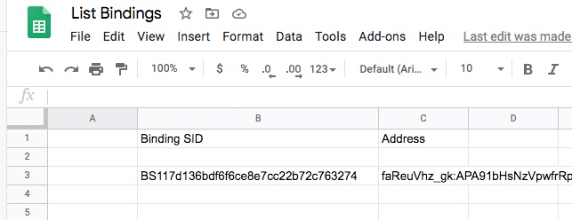

# Using Google Spreadsheet to List Twilio Notify Bindings

--------------------------------------------------------------------------------
## List

Sample Google Spreadsheet script:
````
function myFunction() {
  // -------------------------------------------------------------------------------
  // Get the JSON data.
  // var ACCOUNT_SID = "account_sid";
  // var ACCOUNT_TOKEN = "account_auth_token";
  var ACCOUNT_SID = "ACae0e356ccba96d16d8d4f6f9518684a3";
  var ACCOUNT_TOKEN = "42b42e2ff808e1157d98562ae8547ea2";
  var NOTIFY_SID = "IS6b86eea51935a036f0ae440652761e8a";
  var numberToRetrieve = 20;
  var options = { "method" : "get" };
   options.headers = {
      "Authorization" : "Basic " + Utilities.base64Encode(ACCOUNT_SID + ":" + ACCOUNT_TOKEN)
   };
  var theSheet = SpreadsheetApp.getActiveSheet();
  // curl -X GET 'https://notify.twilio.com/v1/Services/IS6b86eea51935a036f0ae440652761e8a/Bindings?PageSize=20' \
  // var url="https://notify.twilio.com/v1/Services/" + NOTIFY_SID + "/Bindings" + "?PageSize=" + numberToRetrieve;
  var url="https://notify.twilio.com/v1/Services/" + NOTIFY_SID + "/Bindings";
  // theSheet.getRange(1, 6).setValue(url)   // Echo the URL in the spreadsheet.
  var response = UrlFetchApp.fetch(url,options);
  // -------------------------------------------
  // Parse the JSON data and put it into the spreadsheet's active page.
  // Documentation: https://www.twilio.com/docs/api/rest/response
  var theRow = 3;
  var startColumn = 2;
  var dataAll = JSON.parse(response.getContentText());
  for (i = 0; i < dataAll.bindings.length; i++) {
    theColumn = startColumn;
    // -------------------------------------
    theSheet.getRange(theRow, theColumn).setValue(dataAll.bindings[i].sid);
    theColumn++;
    theSheet.getRange(theRow, theColumn).setValue(dataAll.bindings[i].address);
    theRow++
  }
}

````

--------------------------------------------------------------------------------
## Steps to send SMS from a Google Spreadsheet

Screen print of a spreadsheet after sending messages:




--------------------------------------------------------------------------------

Cheers...
