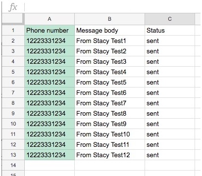

# Using Google Spreadsheet for Twilio SMS

--------------------------------------------------------------------------------
## Receive

Article, How to View Twilio SMS Received Messages in a Google Spreadsheet:
https://www.twilio.com/blog/2018/05/receive-sms-messages-google-sheets-apps-script.html

Requirements:
+ Create a Twilio account: https://twilio.com/console.
+ View your Twilio ACCOUNT SID and AUTH TOKEN (click view): https://twilio.com/console.
+ Buy a phone number. Here is the Twilio Console link to buy one:
https://www.twilio.com/console/phone-numbers/search

The following script includes an error code, if there was an issue.

````
function myFunction() {
  // -------------------------------------------------------------------------------
  // Get the JSON data.
  var ACCOUNT_SID = "account_sid";
  var ACCOUNT_TOKEN = "account_auth_token";
  var toPhoneNumber = "16505552222";
  var numberToRetrieve = 60;
  var hoursOffset = 0;
  var options = { "method" : "get" };
   options.headers = {
      "Authorization" : "Basic " + Utilities.base64Encode(ACCOUNT_SID + ":" + ACCOUNT_TOKEN)
   };
var url="https://api.twilio.com/2010-04-01/Accounts/" + ACCOUNT_SID + "/Messages.json?From=" + toPhoneNumber + "&PageSize=" + numberToRetrieve;
// var url="https://api.twilio.com/2010-04-01/Accounts/" + ACCOUNT_SID + "/Messages.json?To=" + toPhoneNumber + "&PageSize=" + numberToRetrieve;
var response = UrlFetchApp.fetch(url,options);
// -------------------------------------------
// Parse the JSON data and put it into the spreadsheet's active page.
// Documentation: https://www.twilio.com/docs/api/rest/response
var theSheet = SpreadsheetApp.getActiveSheet();
var theRow = 3;
var startColumn = 2;
var dataAll = JSON.parse(response.getContentText());
for (i = 0; i < dataAll.messages.length; i++) {
   theColumn = startColumn;
   // -------------------------------------
   // Date and Time
   rowDate = dataAll.messages[i].date_sent;
   var theDate = new Date (rowDate);
   if(isNaN(theDate.valueOf())) {
      theDate = 'Not a valid date-time';
      theColumn++;
      theColumn++;
   }
   else {
      theDate.setHours(theDate.getHours()+hoursOffset);
      theSheet.getRange(theRow, theColumn).setValue(theDate);
      theColumn++;
      theSheet.getRange(theRow, theColumn).setValue(theDate);
      theColumn++;
   }
   // -------------------------------------
   theSheet.getRange(theRow, theColumn).setValue(dataAll.messages[i].to);
   theColumn++;
   theSheet.getRange(theRow, theColumn).setValue(dataAll.messages[i].from);
   theColumn++;
   theSheet.getRange(theRow, theColumn).setValue(dataAll.messages[i].body);
   theColumn++;
   theSheet.getRange(theRow, theColumn).setValue(dataAll.messages[i].price);
   theColumn++;
   theSheet.getRange(theRow, theColumn).setValue("abc");
   theColumn++;
   theSheet.getRange(theRow, theColumn).setValue(dataAll.messages[i].error_code);
   theRow++
  }
}
````

Following is an advanced program version of the above.
The following can be used to retrieve a conversation between a Twilio phone number and another phone number.
````
// -----------------------------------------------------------------------------
// Parameters for the Twilio request.
//
// --------------------------------
var ACCOUNT_SID = "account_sid";
var ACCOUNT_TOKEN = "account_auth_token";
var phoneNumber1 = "16505551111";
var phoneNumber2 = "+16505552222";

// --------------------------------
var numberToRetrieve = 60;

// -----------------------------------------------------------------------------
// Various sample retrieves.
//
// -----------------
var urlFrom="https://api.twilio.com/2010-04-01/Accounts/" + ACCOUNT_SID + "/Messages.json?From=" + phoneNumber1 + "&PageSize=" + numberToRetrieve;
// -----------------
var urlTo="https://api.twilio.com/2010-04-01/Accounts/" + ACCOUNT_SID + "/Messages.json?To=" + phoneNumber2 + "&PageSize=" + numberToRetrieve;

// ---------------------------------------------------
// Can use the next 2 for a conversation between the 2 given phone numbers.
// -----------------
var urlFromTo1="https://api.twilio.com/2010-04-01/Accounts/" + ACCOUNT_SID + "/Messages.json?From=" + phoneNumber1 + "&To=" + phoneNumber2 + "&PageSize=" + numberToRetrieve;
// -----------------
var urlFromTo2="https://api.twilio.com/2010-04-01/Accounts/" + ACCOUNT_SID + "/Messages.json?From=" + phoneNumber2 + "&To=" + phoneNumber1 + "&PageSize=" + numberToRetrieve;
// -----------------

// -----------------------------------------------------------------------------
function getData(theUrl) {
  // Get the JSON data.
  // -------------------------------------------
  // Parse the JSON data and put it into the spreadsheet's active page.
  // Documentation: https://www.twilio.com/docs/api/rest/response
  var options = { "method" : "get" };
    options.headers = {
      "Authorization" : "Basic " + Utilities.base64Encode(ACCOUNT_SID + ":" + ACCOUNT_TOKEN)
  };
  var theResponse = UrlFetchApp.fetch(theUrl,options);
  var theDataAll = JSON.parse(theResponse.getContentText());
  return(theDataAll);
}

// -----------------------------------------------------------------------------
// Put the retrieved JSON data into the spreadsheet.
//
var theRow = 3;       // First row to print the data.
function displayData(dataAll) {
var theSheet = SpreadsheetApp.getActiveSheet();
var startColumn = 2;
var hoursOffset = 0;
// --------------------------------------------
for (i = 0; i < dataAll.messages.length; i++) {
   theColumn = startColumn;
   // -------------------------------------
   // Date and Time
   rowDate = dataAll.messages[i].date_sent;
   var theDate = new Date (rowDate);
   if(isNaN(theDate.valueOf())) {
      theDate = 'Not a valid date-time';
      theColumn++;
      theColumn++;
   }
   else {
      theDate.setHours(theDate.getHours()+hoursOffset);
      theSheet.getRange(theRow, theColumn).setValue(theDate);
      theColumn++;
      theSheet.getRange(theRow, theColumn).setValue(theDate);
      theColumn++;
   }
   // -------------------------------------
   theSheet.getRange(theRow, theColumn).setValue(dataAll.messages[i].from);
   theColumn++;
   theSheet.getRange(theRow, theColumn).setValue(dataAll.messages[i].to);
   theColumn++;
   theSheet.getRange(theRow, theColumn).setValue(dataAll.messages[i].body);
   theColumn++;
   theSheet.getRange(theRow, theColumn).setValue(dataAll.messages[i].price);
   theColumn++;
   theSheet.getRange(theRow, theColumn).setValue("abc");
   theColumn++;
   theSheet.getRange(theRow, theColumn).setValue(dataAll.messages[i].error_code);
   theRow++
  }
}

// -------------------------------------------------------------------------------
function myFunction() {
  var theData;
  // ---------------------------------------------
  // Get a conversation between 2 phone numbers.
  theData = getData(urlFromTo1);
  displayData(theData);
  theData = getData(urlFromTo2);
  theRow++;
  displayData(theData);
  // ---------------
}
````

--------------------------------------------------------------------------------
## Steps to send SMS from a Google Spreadsheet

Screen print of a spreadsheet after sending messages:



Setup Steps:
+ Create a Google spreadsheet. This requires you have a Google account. If you have a Gmail account, then you have a Google account.
+ In the spreadsheet, enter titles: Column A, "Phone numbers", column B, "Message body", column C, "Status".
+ For the phone numbers, set data type to text string. Click column A. Click the menu item and select: Format/Number/Plain text.
+ Load your phones number into the spreadsheet's Column A, starting in row 2.
+ In the column next to the phone numbers, enter the message you wish to send.
+ From the spreadsheet menu, select Tools/Script Editor.
+ Copy and paste the script into the Google spreadsheet's Script Editor (replacing whatever is there by default):
````
function sendSms(to, body) {
   var ACCOUNT_SID = "your_account_SID";
   var ACCOUNT_TOKEN = "your_account_auth_token";
   var ACCOUNT_PHONE_NUMBER = "your_Twilio_phone_number"; // Sender-id
   //
   var messages_url = "https://api.twilio.com/2010-04-01/Accounts/" + ACCOUNT_SID + "/Messages.json";
   var payload = {
      "To": to,
      "Body" : body,
      "From" : ACCOUNT_PHONE_NUMBER
   };
   var options = {
      "method" : "post",
      "payload" : payload
   };
   options.headers = {
      "Authorization" : "Basic " + Utilities.base64Encode(ACCOUNT_SID + ":" + ACCOUNT_TOKEN)
   };
   UrlFetchApp.fetch(messages_url, options);
}
function sendAll() {
   var sheet = SpreadsheetApp.getActiveSheet();
   var startRow = 2;
   var numRows = sheet.getLastRow() - 1;
   var dataRange = sheet.getRange(startRow, 1, numRows, 2)
   var data = dataRange.getValues();
   for (i in data) {
      var row = data[i];
      try {
         response_data = sendSms(row[0], row[1]);
         status = "sent";
      } catch(err) {
        Logger.log(err);
      status = "error";
      }
      sheet.getRange(startRow + Number(i), 3).setValue(status);
   }
}
````
+ In the script, enter your account SID (by replacing "your_account_SID") and auth token (by replacing "your_account_auth_token") into the script. You get these values from the first screen, when you log into the Twilio Console (http://twilio.com/console). Enter your Twilio phone number (by replacing "your_Twilio_phone_number") into the script, example: "+12223331234".
+ In the Google Spreadsheet Script Editor, click Select function and select sendAll.
+ Save the updates.
+ Run the script. Your messages will be sent.


Reference article, How to Send SMS from a Google Spreadsheet:
https://www.twilio.com/blog/2016/02/send-sms-from-a-google-spreadsheet.html


--------------------------------------------------------------------------------
## Lookup Phone Number from a Google Spreadsheet

Sample output
````
Lookup        Phone number   Type        Carrier	
16505551111   +16505551111   voip        Twilio US1 - Level3 - SMS-Sybase365/MMS-SVR	
16505552222   +16505552222   mobile      Rogers Communications Canada Inc.	
16505553333   +16505553333   landline    AT&T - PSTN	
````
Script:
````
function lookupFunction(thePhoneNumber) {
  // ---------------------------------------------
  // Get the JSON data.
  var ACCOUNT_SID = "your_account_SID";
  var ACCOUNT_TOKEN = "your_account_auth_token";
  var options = {
    "method" : "get"
  };
  options.headers = { 
    "Authorization" : "Basic " + Utilities.base64Encode(ACCOUNT_SID + ":" + ACCOUNT_TOKEN)
  };
  var url="https://lookups.twilio.com/v1/PhoneNumbers/" + thePhoneNumber + "?Type=carrier";
  var response = UrlFetchApp.fetch(url,options);
  var dataAll = JSON.parse(response.getContentText());
  thePhoneNumberFormatted = dataAll.phone_number;
  theCarrier = dataAll.carrier.name;
  theType = dataAll.carrier.type;
}

function myFunction() {
  // ---------------------------------------------
  // Parse the JSON data and put it into the spreadsheet's active page.
  var theSheet = SpreadsheetApp.getActiveSheet();
  var startRow = 2;
  var theColumn = 2;
  //
  var numRows = theSheet.getLastRow() - 1;
  var dataRange = theSheet.getRange(startRow, 1, numRows, 1)
  var data = dataRange.getValues();
  for (i in data) {
    try {
      lookupFunction( data[i] );
      theSheet.getRange(startRow + Number(i), theColumn).setValue(thePhoneNumberFormatted);
      theSheet.getRange(startRow + Number(i), theColumn+1).setValue(theType);
      theSheet.getRange(startRow + Number(i), theColumn+2).setValue(theCarrier);
    } catch(err) {
      Logger.log(err);
      status = "error";
      theSheet.getRange(startRow + Number(i), 2).setValue("- Error running Lookup.");
    }
  }
}
````

--------------------------------------------------------------------------------

Cheers...
