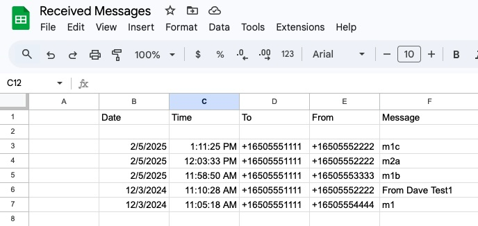
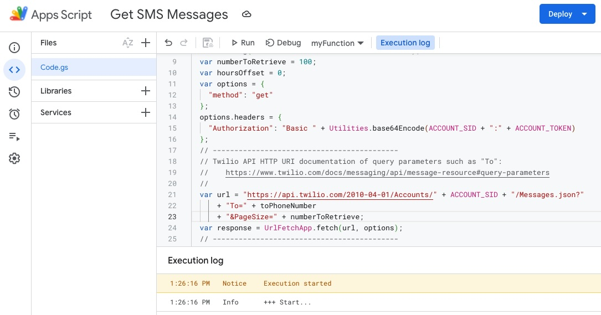

# Using Google Apps Script to make an Twilio API HTTP request to list message logs

--------------------------------------------------------------------------------
## 2 Parts: spreadsheet and a script

1) A Google Spreadsheet with titles such as:
````
Date	Time	To	From	Message
````
The script retrieves the messages and posts the data into the spreadsheet under the titles.



2) Google Apps Script:



--------------------------------------------------------------------------------
### Google Apps Script: Basic Twilio message log listing

Basic script to list message logs sent to a specific "To" phone number where the direction is "inbound".
````
function myFunction() {
  console.log('+++ Start...');
  // -------------------------------------------------------------------------------
  // Get the JSON data.
  var ACCOUNT_SID = "ACa...3";
  var ACCOUNT_TOKEN = "8...3";
  var toPhoneNumber = "16505551111";
  console.log('+ toPhoneNumber = +' + toPhoneNumber);
  var numberToRetrieve = 100;
  var hoursOffset = 0;
  var options = {
    "method": "get"
  };
  options.headers = {
    "Authorization": "Basic " + Utilities.base64Encode(ACCOUNT_SID + ":" + ACCOUNT_TOKEN)
  };
  // -------------------------------------------
  // Twilio API HTTP URI documentation of query parameters such as "To":
  //    https://www.twilio.com/docs/messaging/api/message-resource#query-parameters
  //
  var url = "https://api.twilio.com/2010-04-01/Accounts/" + ACCOUNT_SID + "/Messages.json?"
      + "To=" + toPhoneNumber 
      + "&PageSize=" + numberToRetrieve;
  var response = UrlFetchApp.fetch(url, options);
  // -------------------------------------------
  // Parse the JSON data and put it into the spreadsheet's active page.
  // Documentation: https://www.twilio.com/docs/api/rest/response
  var theSheet = SpreadsheetApp.getActiveSheet();
  var theRow = 3;
  var startColumn = 2;
  var dataAll = JSON.parse(response.getContentText());
  console.log('+ dataAll.messages.length = ' + dataAll.messages.length);
  for (i = 0; i < dataAll.messages.length; i++) {
    if (dataAll.messages[i].direction !== 'inbound') {
      // If not inbound direction, don't list.
      continue;
    }
    console.log('+ From phone number: ' + dataAll.messages[i].from);
    theColumn = startColumn;
    // -------------------------------------
    // Date and Time
    rowDate = dataAll.messages[i].date_sent;
    var theDate = new Date(rowDate);
    if (isNaN(theDate.valueOf())) {
      theDate = 'Not a valid date-time';
      theColumn++;
      theColumn++;
    }
    else {
      theDate.setHours(theDate.getHours() + hoursOffset);
      theSheet.getRange(theRow, theColumn).setValue(theDate);
      theColumn++;
      theSheet.getRange(theRow, theColumn).setValue(theDate);
      theColumn++;
    }
    // -------------------------------------
    // List of properties that can be listed:
    //    https://www.twilio.com/docs/messaging/api/message-resource#message-properties
    //
    theSheet.getRange(theRow, theColumn).setValue(dataAll.messages[i].to);
    theColumn++;
    theSheet.getRange(theRow, theColumn).setValue(dataAll.messages[i].from);
    theColumn++;
    theSheet.getRange(theRow, theColumn).setValue(dataAll.messages[i].body);
    theRow++
    // -------------------------------------
  }
  console.log('+++ Exit...');
}
````

--------------------------------------------------------------------------------
### Google Apps Script: List message logs from 2 phone numbers such a conversation between 2 phone numbers

The following can be used to retrieve a conversation between a Twilio phone number and another phone number.
````
// -----------------------------------------------------------------------------
// Parameters for the Twilio request.
//
// --------------------------------
var ACCOUNT_SID = "account_sid";
var ACCOUNT_TOKEN = "account_auth_token";
var phoneNumber1 = "16505551111";
var phoneNumber2 = "+16505552222";

// --------------------------------
var numberToRetrieve = 60;

// -----------------------------------------------------------------------------
// Various sample retrieves.
//
// -----------------
var urlFrom="https://api.twilio.com/2010-04-01/Accounts/" + ACCOUNT_SID + "/Messages.json?From=" + phoneNumber1 + "&PageSize=" + numberToRetrieve;
// -----------------
var urlTo="https://api.twilio.com/2010-04-01/Accounts/" + ACCOUNT_SID + "/Messages.json?To=" + phoneNumber2 + "&PageSize=" + numberToRetrieve;

// ---------------------------------------------------
// Can use the next 2 for a conversation between the 2 given phone numbers.
// -----------------
var urlFromTo1="https://api.twilio.com/2010-04-01/Accounts/" + ACCOUNT_SID + "/Messages.json?From=" + phoneNumber1 + "&To=" + phoneNumber2 + "&PageSize=" + numberToRetrieve;
// -----------------
var urlFromTo2="https://api.twilio.com/2010-04-01/Accounts/" + ACCOUNT_SID + "/Messages.json?From=" + phoneNumber2 + "&To=" + phoneNumber1 + "&PageSize=" + numberToRetrieve;
// -----------------

// -----------------------------------------------------------------------------
function getData(theUrl) {
  // Get the JSON data.
  // -------------------------------------------
  // Parse the JSON data and put it into the spreadsheet's active page.
  // Documentation: https://www.twilio.com/docs/api/rest/response
  var options = { "method" : "get" };
    options.headers = {
      "Authorization" : "Basic " + Utilities.base64Encode(ACCOUNT_SID + ":" + ACCOUNT_TOKEN)
  };
  var theResponse = UrlFetchApp.fetch(theUrl,options);
  var theDataAll = JSON.parse(theResponse.getContentText());
  return(theDataAll);
}

// -----------------------------------------------------------------------------
// Put the retrieved JSON data into the spreadsheet.
//
var theRow = 3;       // First row to print the data.
function displayData(dataAll) {
var theSheet = SpreadsheetApp.getActiveSheet();
var startColumn = 2;
var hoursOffset = 0;
// --------------------------------------------
for (i = 0; i < dataAll.messages.length; i++) {
   theColumn = startColumn;
   // -------------------------------------
   // Date and Time
   rowDate = dataAll.messages[i].date_sent;
   var theDate = new Date (rowDate);
   if(isNaN(theDate.valueOf())) {
      theDate = 'Not a valid date-time';
      theColumn++;
      theColumn++;
   }
   else {
      theDate.setHours(theDate.getHours()+hoursOffset);
      theSheet.getRange(theRow, theColumn).setValue(theDate);
      theColumn++;
      theSheet.getRange(theRow, theColumn).setValue(theDate);
      theColumn++;
   }
   // -------------------------------------
   theSheet.getRange(theRow, theColumn).setValue(dataAll.messages[i].from);
   theColumn++;
   theSheet.getRange(theRow, theColumn).setValue(dataAll.messages[i].to);
   theColumn++;
   theSheet.getRange(theRow, theColumn).setValue(dataAll.messages[i].body);
   theColumn++;
   theSheet.getRange(theRow, theColumn).setValue(dataAll.messages[i].price);
   theColumn++;
   theSheet.getRange(theRow, theColumn).setValue("abc");
   theColumn++;
   theSheet.getRange(theRow, theColumn).setValue(dataAll.messages[i].error_code);
   theRow++
  }
}

// -------------------------------------------------------------------------------
function myFunction() {
  var theData;
  // ---------------------------------------------
  // Get a conversation between 2 phone numbers.
  theData = getData(urlFromTo1);
  displayData(theData);
  theData = getData(urlFromTo2);
  theRow++;
  displayData(theData);
  // ---------------
}
````

--------------------------------------------------------------------------------

Manage [projects](https://script.google.com/home)

[Web Apps](https://developers.google.com/apps-script/guides/web)

Article, How to View Twilio SMS Received Messages in a Google Spreadsheet:
https://www.twilio.com/blog/2018/05/receive-sms-messages-google-sheets-apps-script.html

Requirements:
+ Create a Twilio account: https://twilio.com/console.
+ View your Twilio ACCOUNT SID and AUTH TOKEN (click view): https://twilio.com/console.
+ Buy a phone number. Here is the Twilio Console link to buy one:
https://www.twilio.com/console/phone-numbers/search
+ Register the number.

--------------------------------------------------------------------------------
Cheers...
