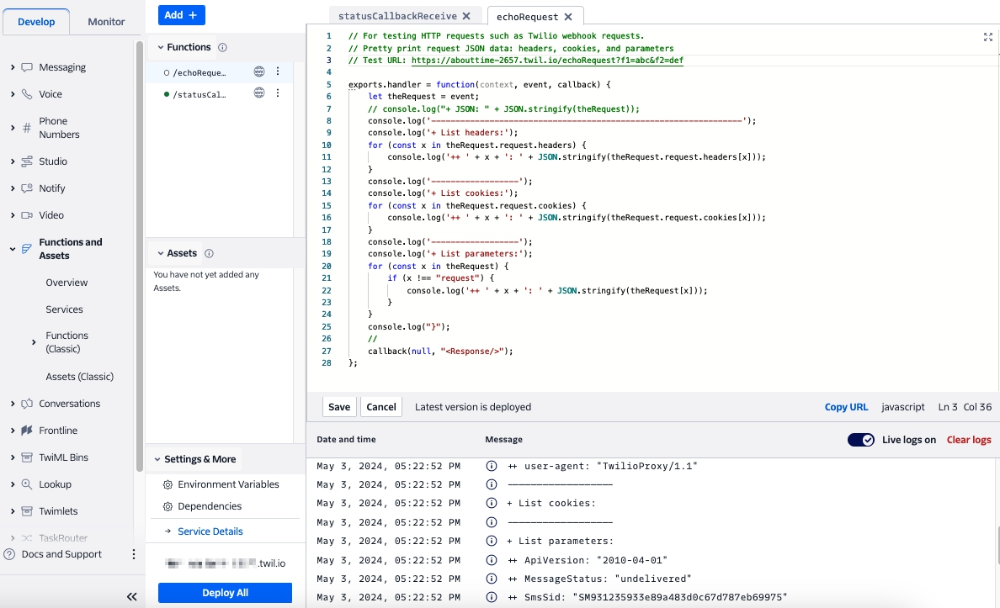

### Twilio Function to capture the HTTP request contents:

````
exports.handler = function(context, event, callback) {
    let theRequest = event;
    // console.log("+ JSON: " + JSON.stringify(theRequest));
    console.log('----------------------------------------------------------------');
    console.log('+ List headers:');
    for (const x in theRequest.request.headers) {
        console.log('++ ' + x + ': ' + JSON.stringify(theRequest.request.headers[x]));
    }
    console.log('------------------');
    console.log('+ List cookies:');
    for (const x in theRequest.request.cookies) {
        console.log('++ ' + x + ': ' + JSON.stringify(theRequest.request.cookies[x]));
    }
    console.log('------------------');
    console.log('+ List parameters:');
    for (const x in theRequest) {
        if (x !== "request") {
            console.log('++ ' + x + ': ' + JSON.stringify(theRequest[x]));
        }
    }
    console.log("}");
    //
    callback(null, "<Response/>");
};
````

+ I made an SMS request that would fail because the Twilio phone number is not registered to send SMS.
+ Received the callback status request content:
````
+ List headers:
...
+ x-twilio-signature: "x9c+VTg...BSo="
...
+ List parameters:
++ ApiVersion: "2010-04-01"
++ MessageStatus: "undelivered"
++ SmsSid: "SMf0bc7a034bb25ff30b6ccd43f48ff9ee"
++ SmsStatus: "undelivered"
++ ErrorCode: "30034"
++ To: "+16505552222"
++ From: "+16505551111"
++ MessageSid: "SMf0bc7a034bb25ff30b6ccd43f48ff9ee"
++ AccountSid: "ACae...a3"
````

Twilio Console Functions screen print showing logs.



--------------------------------------------------------------------------------
Another sample echo program:
````
// For testing HTTP requests such as Twilio webhook requests.
// Pretty print request JSON data: headers, cookies, and parameters

exports.handler = function(context, event, callback) {
    let theRequest = event;
    // console.log("+ JSON: " + JSON.stringify(theRequest));
    //
    console.log('----------------------------------------------------------------');
    console.log('+ List context:');
    for (const x in context) {
        if (x !== "AUTH_TOKEN") {
            console.log('++ ' + x + ': ' + JSON.stringify(context[x]));
        }
    }
    console.log('+ context.DOMAIN_NAME: ' + context.DOMAIN_NAME);
    console.log('+ context.PATH: ' + context.PATH);
    //
    console.log('----------------------------------------------------------------');
    console.log('+ List headers:');
    for (const x in theRequest.request.headers) {
        console.log('++ ' + x + ': ' + JSON.stringify(theRequest.request.headers[x]));
    }
    console.log('------------------');
    console.log('+ List cookies:');
    for (const x in theRequest.request.cookies) {
        console.log('++ ' + x + ': ' + JSON.stringify(theRequest.request.cookies[x]));
    }
    console.log('------------------');
    console.log('+ List parameters:');
    for (const x in theRequest) {
        if (x !== "request") {
            console.log('++ ' + x + ': ' + JSON.stringify(theRequest[x]));
        }
    }
    console.log("}");
    //
    theResponse = '<?xml version="1.0" encoding="UTF-8"?><Response><Message><Body>F1</Body></Message></Response>';
    // theResponse = "<Response/>";
    callback(null, theResponse);
};
````
--------------------------------------------------------------------------------
Cheers
