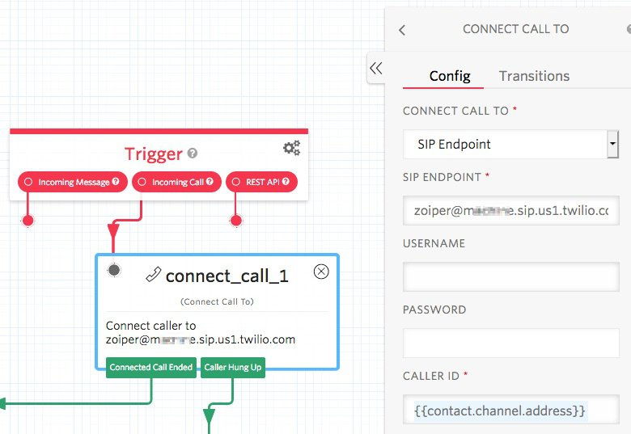

# Connect to Widget, Connecting to a SIP Endpoint

## Notes

This sample uses my Twilio SIP Domain endpoint, which is a Cisco SPA112 device.

--------------------------------------------------------------------------------
Studio flow screen print:

--------------------------------------------------------------------------------

Cheers...
