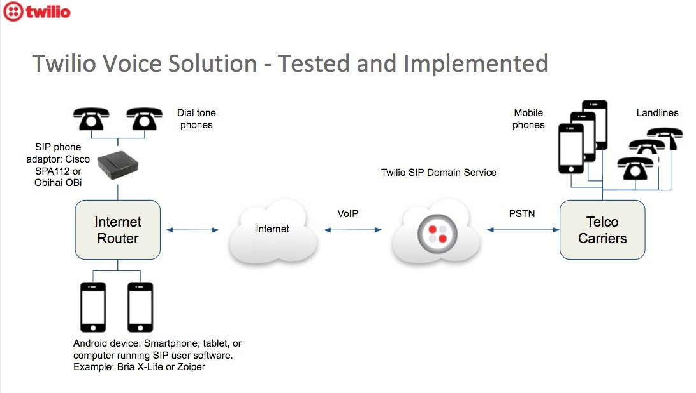

# Studio Connect to Widget, Connecting to a SIP Endpoint

## Notes

In the screen print following, the sample uses my Twilio SIP Domain endpoint, which connects to a Cisco SPA112 device.

--------------------------------------------------------------------------------
Studio flow screen print:

SIP Domain flow diagram:

--------------------------------------------------------------------------------

Cheers...
