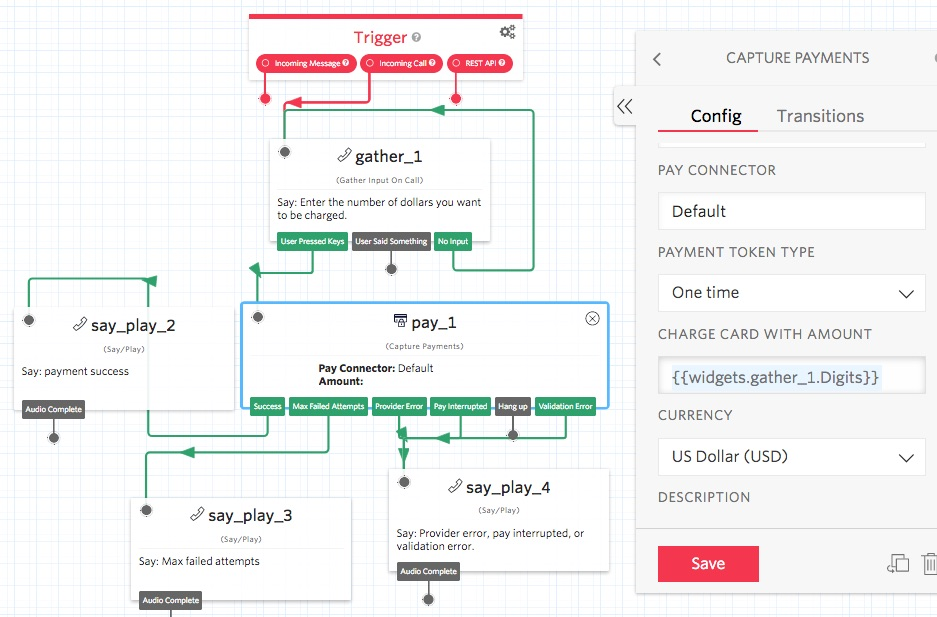

# Notes

--------------------------------------------------------------------------------
## Using the Twilio Studio Capture Payment Widget


Following are the steps I used to successfully make a payment for a dollar amount entered by the caller (DTMF). The payment made in the Studio flow, shows up in the Stripe payment section.

+ I created a Stripe account as recommended in the tutorial: Stripe https://dashboard.stripe.com/register

https://www.twilio.com/docs/voice/tutorials/how-capture-your-first-payment-using-pay

+ I configured my Twilio account as described in the tutorial.
  Important note, when configuring your Twilio Stripe Connector, use Mode: test. This will allow you to test your setup and test the following Studio flow using a Visa test phone number (listed below).
+ I developed a Studio flow which includes a Gather, to gather the dollar amount the person wants to pay (see screen print below). Note, in the Capture Payments widget, I set "Request Postal Code?" to No.
+ I configured a Twilio phone number to use the Pay Studio flow.
+ I called the phone number. The Gather widget asked me to enter a dollar amount, which I did.
+ The Capture Payments widget asked me for my credit card details. I used a Visa test card number:
````
Test visa card # 4012888888881881, which is: 4012 8x8s 1881
Expiration date: 1219
Security code: 123
````
+ My payment was confirmed.
+ Check my Stripe account dashboard payments. The payment was listed:

https://dashboard.stripe.com/test/payments

Note, the flow doesn't handle cents at this time.

Studio flow screen print:



Pay data flow diagram


--------------------------------------------------------------------------------

Cheers...
