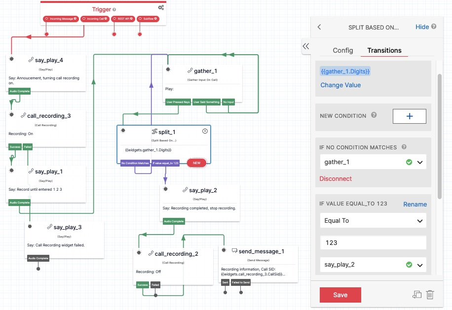

# Twilio Studio Loop

Recording loop, until a code is entered:
+ Say an annoucement message.
+ Turn recording on.
+ Use a Gather to wait while the caller is talking. The Gather widget has "#" as the "Stop gathering on keypress?"
+ When the Gather is complete, Split checks if the person entered the code. In my test, the code I selected is "#123", which is in the Split widget.  
+ When the code is entered, the flow continues to close out the call and turn recording off.

--------------------------------------------------------------------------------

Cheers...
