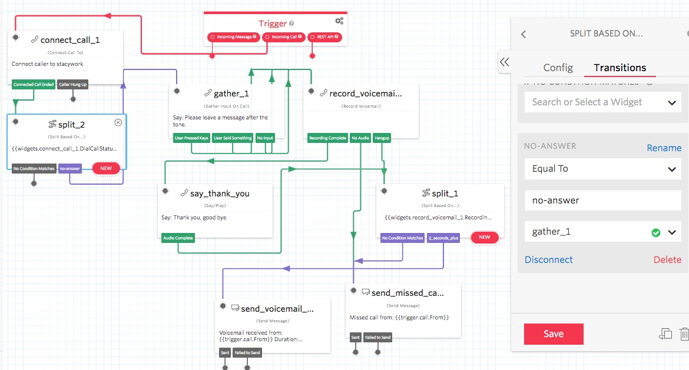
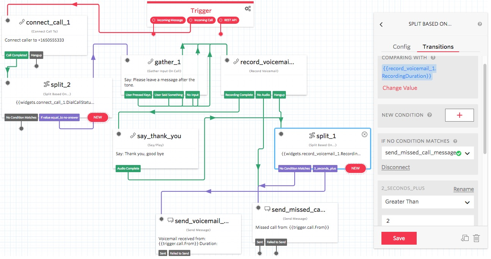
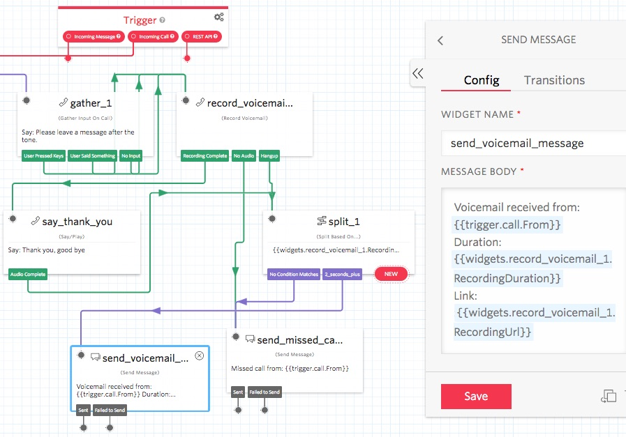

# Implement a Feature Rich Voicemail System

## Features:

+ If the call is answered, the caller does not get a voicemail option.
+ Set your own voicemail greeting message, and a thank you message.
+ If the caller hangs up without leaving voicemail, you will receive a missed call SMS with the caller’s phone number.
+ If the person leaves a voicemail message, you will receive an SMS text message with an active link to the voicemail message. Click/tap on the link to cause your browser to display the voicemail sound file. Click on the browser icon to hear the voicemail message.

For a Twilio Functions and TwiML Bins configuration, click [here](../book/voicemail).

### Import Option

When creating a new Studio flow, you have the option to Import from JSON.
You can my sample JSON definition:
[Studio-VoicemailSMS.json](Studio-VoicemailSMS.json).

--------------------------------------------------------------------------------

Following is a screen print of a voicemail setup using the Twilio Console Studio drag and drop tool.



The following shows the other Split attribute, if recording is greater than 2 seconds.



The following shows the send SMS attribute which includes the message body with the voicemail details.



In your Send Message widget's attribute, Body, enter the following:
````
Voicemail received from: {{trigger.call.From}} 
Duration: {{widgets.record_voicemail_1.RecordingDuration}} 
Link: :{{widgets.record_voicemail_1.RecordingUrl}}
````
You can use a Studio Send Message widget to send an SMS with voicemail details and a link to the recording. On my phone, when I tap on the link it causes my browser to display the voicemail sound file link. I click on the browser icon to listen to the voicemail message.

The following shows the a Twilio phone number configured to use the above Studio voicemail flow.


--------------------------------------------------------------------------------

## Test

+ Test by calling your Twilio Phone number. The call should be forward as configured.
+ If you answer the call, you will not be prompted for voicemail, nor will you be sent an SMS regarding this call.
+ If you don't answer the call, you will be sent an SMS regarding the missed call.
++ If you stay on, you will be prompted to leave a voicemail message.
++ If you leave a voicemail message, you be sent an SMS regarding the voicemail.
++ If you stay on the call after leaving a voicemail, you will hear the thank you message and then, the call will be ended.

--------------------------------------------------------------------------------

Cheers...
